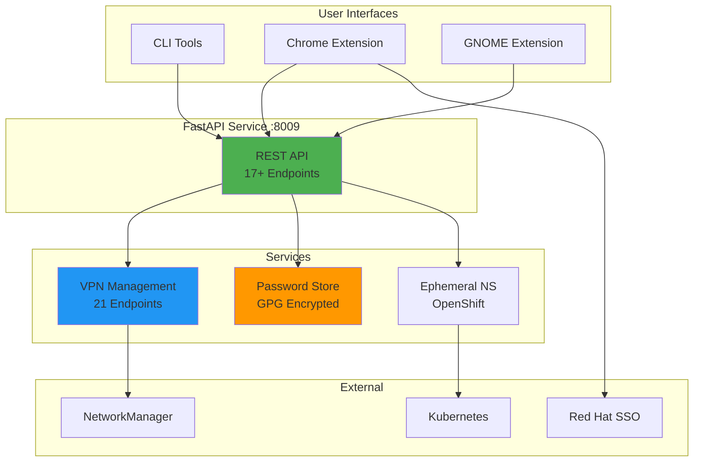
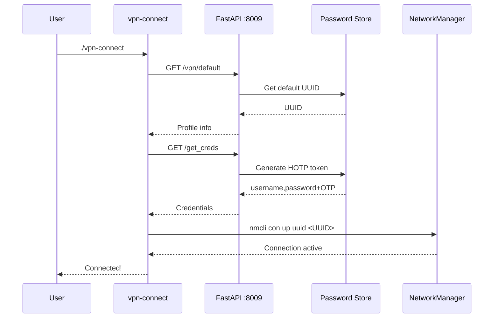
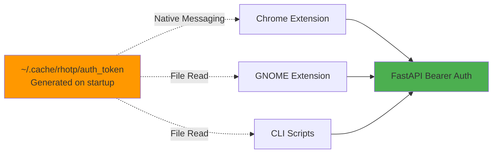

<div align="center">


# Red Hat OTP Auto-Connect

> 🔐 Comprehensive automation system for Red Hat VPN access, SSO authentication, and ephemeral environment management

[](https://www.python.org/downloads/)
[](https://fastapi.tiangolo.com/)
[](LICENSE.txt)
[](https://github.com/psf/black)
[](docs/DEVELOPER_GUIDE.md#contributing)
[](docs/)
[](docs/USER_GUIDE.md#available-vpn-endpoints)
[](docs/drawings/)

</div>

---

## 📖 Overview

**RH-OTP Auto-Connect** is a multi-component system that streamlines Red Hat infrastructure access through:

- 🌐 **21 Global VPN Endpoints** - One-click connection to Red Hat VPN worldwide
- 🔑 **Automated Authentication** - HOTP token generation and SSO auto-login
- 🖥️ **Desktop Integration** - GNOME Shell extension with system tray
- 🌍 **Chrome Extension** - Browser automation for Red Hat portals
- ☁️ **Ephemeral Namespaces** - Bonfire/OpenShift environment management
- 🔒 **Secure Credentials** - GPG-encrypted password storage

<div align="center">

```
╔══════════════════════════════════════════════════════════════╗
║  🎯 One System, Complete VPN & Authentication Automation  ║
║  ✅ 21 Global Endpoints  •  ✅ Auto SSO Login              ║
║  ✅ GNOME Integration    •  ✅ Chrome Extension             ║
╚══════════════════════════════════════════════════════════════╝
```

</div>

### 🏛️ System Architecture



---

## ✨ Features

### 🌐 VPN Management

- **21 Global Endpoints**: IAD2 (US), BRQ2 (CZ), AMS2 (NL), NRT (JP), and more
- **Profile-Based Configuration**: YAML-driven VPN profiles
- **One-Click Connection**: CLI, API, or GUI
- **Real-Time Status**: Monitor active VPN connections
- **Default Profile Management**: Set preferred endpoint

### 🔐 Authentication & Security

- **HOTP Token Generation**: RFC 4226 compliant one-time passwords
- **GPG Encryption**: All credentials encrypted with user's GPG key
- **Bearer Token API**: Secure localhost-only API access
- **Native Messaging**: Secure Chrome extension bridge
- **No Network Exposure**: Service binds to localhost only

### 🖥️ Desktop Integration (GNOME)

- **System Tray Icon**: Red Hat branded indicator
- **VPN Profile Menu**: All 21 endpoints organized by region
- **Real-Time Monitoring**: VPN status updates every 30 seconds
- **Password Operations**: Quick credential clipboard access
- **Desktop Notifications**: Operation feedback
- **Native Settings**: GNOME preferences integration

### 🌍 Chrome Extension

- **Auto-Login**: Automatic form filling on Red Hat SSO pages
- **Native Messaging**: Secure token access
- **Manifest V3**: Future-proof Chrome extension
- **Context Switching**: Associate vs. ephemeral credentials
- **Ephemeral Integration**: Namespace management from browser

### ☁️ Ephemeral Namespace Management

- **Bonfire Integration**: OpenShift environment operations
- **Namespace Details**: Route, expiration, credentials
- **Duration Extension**: Extend reservations via API
- **Status Monitoring**: Check namespace availability
- **Cache Management**: Refresh namespace data

---

## 🚀 Quick Start

### 💾 Installation

```bash
# Clone repository
git clone https://github.com/yourusername/rh-otp-auto-connect.git
cd rh-otp-auto-connect/src

# Install everything (service, extensions, profiles)
make install

# Start service
systemctl --user start rhotp
```

### 🔑 Setup Password Store

```bash
# Initialize password store (if not already done)
pass init <your-gpg-key-id>

# Add required secrets
pass insert redhat.com/username
pass insert redhat.com/associate-password
pass insert redhat.com/hotp-secret
pass insert redhat.com/hotp-counter
```

### 🔌 Connect to VPN

```bash
# Quick connect to default VPN
./vpn-connect

# Or using Makefile
make vpn-connect

# Connect to specific endpoint
./vpn-profile-manager connect BRQ2

# List all available profiles
make vpn-profiles-list
```

**Output**:
```
Found 21 VPN profiles:

ID              Name                                     Remote                              Proto
====================================================================================================
IAD2            Ashburn (IAD2)                           ovpn-iad2.redhat.com                TCP
BRQ2            Brno (BRQ2)                              ovpn-brq2.redhat.com                TCP
AMS2            Amsterdam (AMS2)                         ovpn-ams2.redhat.com                TCP
...
```

---

## 📚 Documentation

### 🔗 Quick Links

| Document | Description |
|----------|-------------|
| **[📖 User Guide](docs/USER_GUIDE.md)** | Installation, usage, troubleshooting |
| **[🏗️ Architecture](docs/ARCHITECTURE.md)** | System design, components, data flows |
| **[🔌 API Reference](docs/API.md)** | Complete REST API documentation |
| **[👨‍💻 Developer Guide](docs/DEVELOPER_GUIDE.md)** | Development setup, testing, contributing |
| **[🔐 Authentication Flows](docs/drawings/AUTH_FLOWS.md)** | Security and credential diagrams |
| **[🌐 VPN Workflows](docs/drawings/VPN_WORKFLOWS.md)** | VPN connection diagrams |
| **[📋 Documentation Index](docs/README.md)** | Complete documentation overview |

### 📝 Documentation Highlights

- **30+ Mermaid Diagrams** - Interactive diagrams that render in GitHub
- **4,500+ Lines** - Comprehensive coverage of all components
- **Code Examples** - Python, Bash, JavaScript samples
- **Troubleshooting Guides** - Common issues and solutions
- **FAQ** - Frequently asked questions

---

## 🛠️ Components

### 1. FastAPI Service (Port 8009)

**Core authentication and credential management API**

- 17+ REST endpoints
- Bearer token authentication
- Uvicorn ASGI server
- Auto-reload in development mode

**Key Endpoints**:
```bash
GET  /vpn/profiles          # List all 21 VPN profiles
POST /vpn/connect/{id}      # Connect to specific profile
GET  /vpn/status            # Get connection status
POST /vpn/disconnect        # Disconnect active VPN
GET  /get_creds             # Get username + password + OTP
```

**[Full API Documentation →](docs/API.md)**

---

### 2. VPN Management System

**Manage 21 Red Hat VPN endpoints globally**

**🗺️ Supported Locations**:
- 🌎 **Americas**: IAD2 (Ashburn), RDU2 (Raleigh), GRU2 (São Paulo)
- 🌍 **Europe**: AMS2 (Amsterdam), BRQ2 (Brno), LCY (London), FAB (Farnborough)
- 🌏 **Asia-Pacific**: NRT (Tokyo), PEK2 (Beijing), SIN2 (Singapore), SYD (Sydney), PNQ2 (Pune)
- 🌐 **Global**: GLOBAL (ovpn.redhat.com)

**🔧 Tools**:
- `vpn-connect` - Quick VPN connection script
- `vpn-profile-manager` - Full CLI management tool
- `vpn-profiles/profiles.yaml` - Configuration file

**[VPN Workflows Documentation →](docs/drawings/VPN_WORKFLOWS.md)**

---

### 3. Chrome Extension

**Browser automation for Red Hat SSO and ephemeral environments**

**✨ Features**:
- ✅ Auto-fill credentials on Red Hat login pages
- ✅ One-click password retrieval
- ✅ Ephemeral namespace management
- ✅ Native messaging for secure token access
- ✅ Manifest V3 compliance

**🌐 Supported Pages**:
- `auth.redhat.com` - Main SSO portal
- `sso.redhat.com` - Secondary SSO
- Ephemeral environment login pages

**📦 Installation**:
```bash
make install-chrome

# Load extension in Chrome
# 1. chrome://extensions/ → Enable Developer mode
# 2. Load unpacked → Select src/rh-otp/
# 3. Copy extension ID
# 4. Run: python3 install_native_host.py --extension-id <ID>
```

**[Chrome Extension Guide →](docs/USER_GUIDE.md#chrome-extension)**

---

### 4. GNOME Shell Extension

**Desktop integration with system tray and notifications**

**✨ Features**:
- 🎯 System tray icon with Red Hat branding
- 📋 VPN profile submenu (21 endpoints by region)
- 📊 Real-time VPN status monitoring
- 📋 Password clipboard operations
- 🔔 Desktop notifications
- ⚙️ Native GNOME preferences UI

**📦 Installation**:
```bash
make install-gnome
make gnome-enable

# Open preferences
make gnome-prefs
```

**[GNOME Extension Guide →](docs/USER_GUIDE.md#gnome-extension)**

---

### 5. Ephemeral Namespace Management

**Bonfire/OpenShift environment automation**

**⚡ Capabilities**:
- List and filter namespaces
- Get namespace details (route, expiration, password)
- Extend reservation duration
- Cache management

**💡 Example**:
```bash
TOKEN=$(cat ~/.cache/rhotp/auth_token)

# Get namespace details with password
curl -H "Authorization: Bearer $TOKEN" \
  "http://localhost:8009/ephemeral/namespace/details?include_password=true"

# Extend namespace by 48 hours
curl -X POST \
  -H "Authorization: Bearer $TOKEN" \
  -H "Content-Type: application/json" \
  -d '{"duration": "48h"}' \
  http://localhost:8009/ephemeral/namespace/extend
```

**[Ephemeral Documentation →](docs/USER_GUIDE.md#ephemeral-namespaces)**

---

## 🏗️ Architecture

### 🛠️ Technology Stack

| Layer | Technology | Purpose |
|-------|-----------|---------|
| **Backend** | FastAPI, Uvicorn | REST API server |
| **Frontend** | Chrome Extension (Manifest V3) | Browser automation |
| **Desktop** | GNOME Shell Extension (GJS) | System integration |
| **Security** | GPG, Pass, HOTP (RFC 4226) | Credential management |
| **VPN** | NetworkManager, OpenVPN | VPN connectivity |
| **Cloud** | Bonfire, OpenShift, Kubernetes | Ephemeral environments |

### 🔄 Data Flow



**[Full Architecture Documentation →](docs/ARCHITECTURE.md)**

---

## 🔒 Security

### 🔐 Encryption & Storage

- **GPG Encryption**: All credentials encrypted with user's GPG key
- **Password Store**: Standard Unix `pass` password manager
- **HOTP Secrets**: Never transmitted unencrypted
- **Temp Files**: Immediate deletion after use (chmod 600)

### 🛡️ API Security

- **Bearer Tokens**: Cryptographically secure random tokens
- **Localhost Only**: No network exposure (binds to 127.0.0.1:8009)
- **File Permissions**: 600 on token file
- **Timing-Safe Comparison**: `secrets.compare_digest()` for token validation

### 🔑 Authentication Flow



**[Security Documentation →](docs/drawings/AUTH_FLOWS.md)**

---

## 📋 Prerequisites

### 💻 System Requirements

- **OS**: Linux (Fedora/RHEL recommended)
- **Python**: 3.11 or higher
- **NetworkManager**: For VPN connections
- **GPG**: Configured with user key
- **Pass**: Unix password manager

### 🔧 Optional Dependencies

- **Chrome/Chromium**: For browser extension
- **GNOME Shell**: For desktop extension (versions 3.36-49+)
- **Bonfire CLI**: For ephemeral namespace management
- **oc/kubectl**: For Kubernetes operations

### 📥 Installation

```bash
# Fedora/RHEL
sudo dnf install python3-pip NetworkManager-cli pass gpg

# Install Python dependencies
make install-deps

# Or using Pipenv
pipenv install
```

---

## 🎯 Usage Examples

### VPN Management

```bash
# List all 21 VPN profiles
./vpn-profile-manager list

# Connect to specific endpoint
./vpn-profile-manager connect IAD2

# Check VPN status
make vpn-status

# Disconnect
make vpn-disconnect
```

### API Usage (Python)

```python
import requests

TOKEN = open("~/.cache/rhotp/auth_token").read().strip()
BASE_URL = "http://localhost:8009"
HEADERS = {"Authorization": f"Bearer {TOKEN}"}

# List VPN profiles
response = requests.get(f"{BASE_URL}/vpn/profiles", headers=HEADERS)
profiles = response.json()

# Connect to VPN
response = requests.post(
    f"{BASE_URL}/vpn/connect/brq2",
    headers=HEADERS
)
print(response.json()["message"])  # "Connected to Brno (BRQ2)"

# Get credentials
response = requests.get(f"{BASE_URL}/get_creds", headers=HEADERS)
username, password_with_otp = response.text.strip().strip('"').split(',')
```

### API Usage (Bash)

```bash
TOKEN=$(cat ~/.cache/rhotp/auth_token)
BASE="http://localhost:8009"

# Get VPN status
curl -s -H "Authorization: Bearer $TOKEN" "$BASE/vpn/status" | jq .

# Extend ephemeral namespace
curl -s -X POST \
  -H "Authorization: Bearer $TOKEN" \
  -H "Content-Type: application/json" \
  -d '{"duration": "48h"}' \
  "$BASE/ephemeral/namespace/extend" | jq .
```

---

## 🔧 Development

### 🚀 Setup Development Environment

```bash
# Install dev dependencies
pipenv install --dev

# Start service in dev mode (auto-reload)
make dev

# Run tests
make test

# Run linters
make lint

# Format code
make format
```

### 📁 Project Structure

```
src/
├── main.py                    # FastAPI entry point
├── api/
│   ├── routes/               # Endpoint handlers
│   ├── models/               # Pydantic models
│   └── dependencies/         # Shared dependencies
├── services/
│   ├── vpn.py               # VPN business logic
│   ├── ephemeral.py         # Bonfire integration
│   └── password_store.py    # GPG/pass integration
├── vpn-profiles/
│   └── profiles.yaml        # VPN configuration
├── rh-otp/                  # Chrome extension
└── rh-otp-gnome/            # GNOME extension
```

**[Developer Guide →](docs/DEVELOPER_GUIDE.md)**

---

## 🎨 Feature Showcase

<div align="center">

| 🌐 Global VPN | 🔐 Auto-Login | 🖥️ Desktop UI | ☁️ Ephemeral |
|:------------:|:-------------:|:------------:|:------------:|
| 21 worldwide endpoints | One-click SSO auth | GNOME integration | OpenShift mgmt |
| Real-time status | HOTP token gen | System tray icon | Namespace extend |
| Profile manager | Chrome extension | Notifications | API automation |

</div>

---

## 🤝 Contributing

Contributions are welcome! Please:

1. **Fork** the repository
2. **Create** a feature branch (`git checkout -b feature/amazing-feature`)
3. **Commit** your changes (`git commit -m 'feat: add amazing feature'`)
4. **Push** to the branch (`git push origin feature/amazing-feature`)
5. **Open** a Pull Request

**Guidelines**:
- Follow PEP 8 code style
- Add tests for new features
- Update documentation
- Use conventional commit messages

**[Contributing Guidelines →](docs/DEVELOPER_GUIDE.md#contributing)**

---

<div align="center">

### ⭐ Star this project if you find it useful! ⭐

</div>

---

## 📊 Project Statistics

| Metric | Count |
|--------|-------|
| **Total Code** | ~3,500 lines |
| **API Endpoints** | 17+ |
| **VPN Profiles** | 21 global |
| **Documentation** | 4,500+ lines |
| **Diagrams** | 30+ Mermaid |
| **Test Coverage** | Growing |

---

## 🗺️ Roadmap

### Current Features ✅

- [x] VPN management (21 global endpoints)
- [x] Chrome extension with native messaging
- [x] GNOME Shell extension
- [x] Ephemeral namespace management
- [x] HOTP token generation
- [x] Comprehensive documentation

### Planned Features 🚧

- [ ] Bonfire namespace reservation/release ([See proposal](plans/bonfire_feature_proposal.md))
- [ ] Application deployment management
- [ ] Resource monitoring and health checks
- [ ] Rate limiting for API
- [ ] Async operations (full async/await)
- [ ] Command-line tool consolidation ([See analysis](plans/script_consolidation_proposal.md))

**[Feature Proposals →](plans/)**

---

## 📝 License

This project is licensed under the MIT License - see [LICENSE.txt](LICENSE.txt) for details.

---

## 🙏 Acknowledgments

- **FastAPI** - Modern, fast web framework
- **Pass** - Standard Unix password manager
- **NetworkManager** - Linux network management
- **Bonfire** - Red Hat ephemeral environment tool
- **GNOME** - Desktop environment integration

---

## 📞 Support & Contact

- **Documentation**: [docs/](docs/)
- **Issues**: GitHub Issues
- **Discussions**: GitHub Discussions
- **Architecture Diagrams**: [docs/drawings/](docs/drawings/)

---

## 🔗 Quick Links

| Resource | Link |
|----------|------|
| 📖 **Documentation** | [docs/README.md](docs/README.md) |
| 🏗️ **Architecture** | [docs/ARCHITECTURE.md](docs/ARCHITECTURE.md) |
| 🔌 **API Reference** | [docs/API.md](docs/API.md) |
| 👤 **User Guide** | [docs/USER_GUIDE.md](docs/USER_GUIDE.md) |
| 👨‍💻 **Developer Guide** | [docs/DEVELOPER_GUIDE.md](docs/DEVELOPER_GUIDE.md) |
| 🔐 **Security Flows** | [docs/drawings/AUTH_FLOWS.md](docs/drawings/AUTH_FLOWS.md) |
| 🌐 **VPN Workflows** | [docs/drawings/VPN_WORKFLOWS.md](docs/drawings/VPN_WORKFLOWS.md) |
| 📋 **Feature Plans** | [plans/](plans/) |

---

<div align="center">


**Made with ❤️ for Red Hat Infrastructure Automation**

[📖 Documentation](docs/) • [🔌 API Reference](docs/API.md) • [👨‍💻 Contributing](docs/DEVELOPER_GUIDE.md#contributing) • [🐛 Report Bug](../../issues) • [💡 Request Feature](../../issues)

---

### 🌟 Show your support

Give a ⭐️ if this project helped you!

---

<sub>Built with [FastAPI](https://fastapi.tiangolo.com/) • Powered by [Python](https://www.python.org/) • Secured with [GPG](https://gnupg.org/)</sub>

</div>
