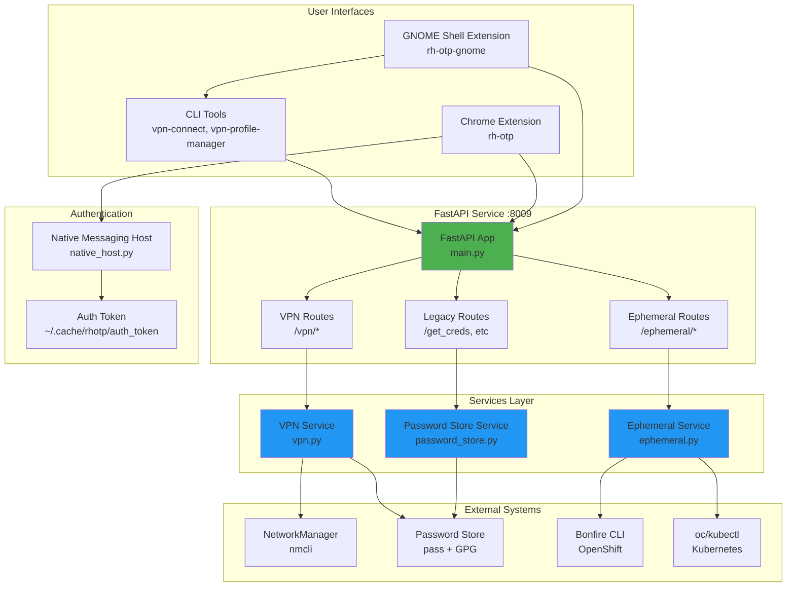
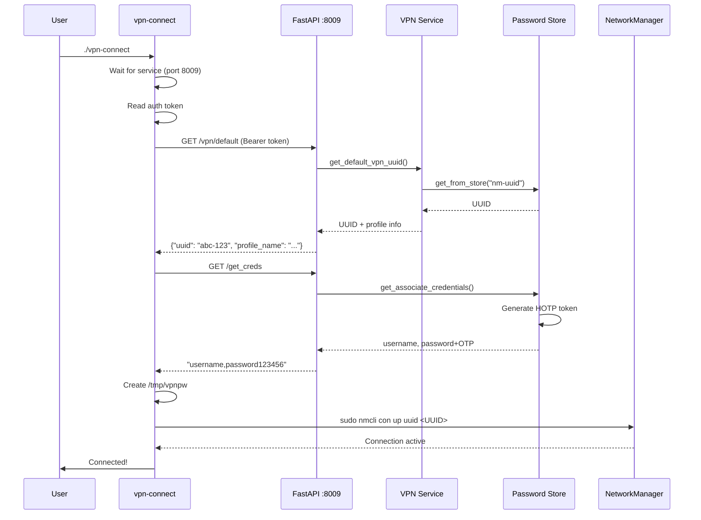
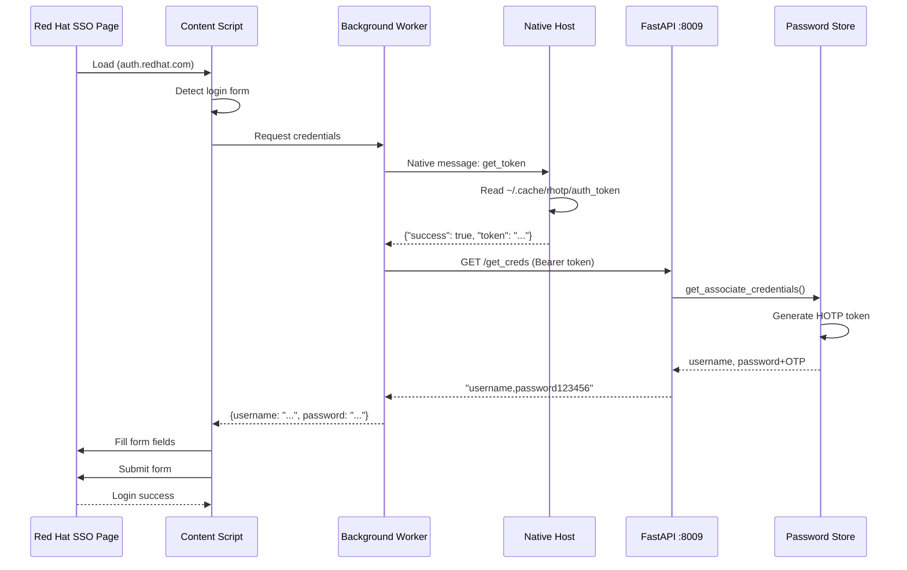
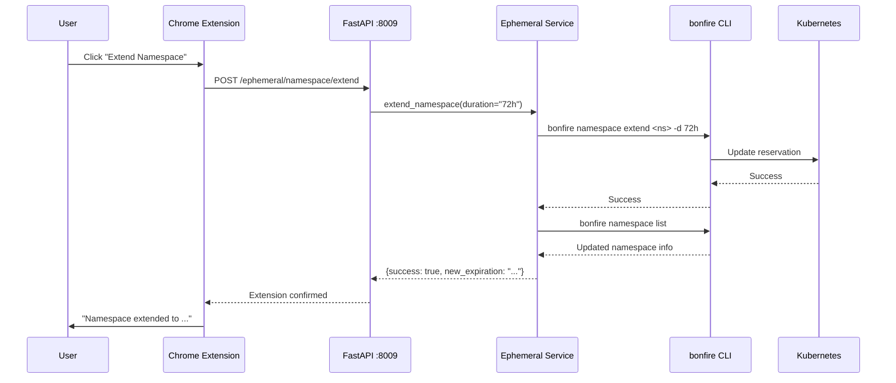
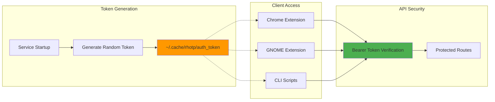
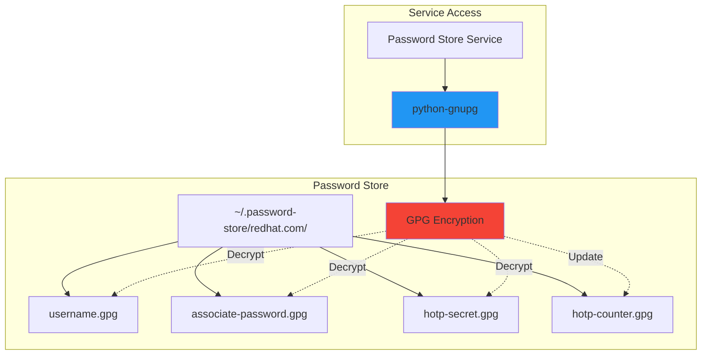
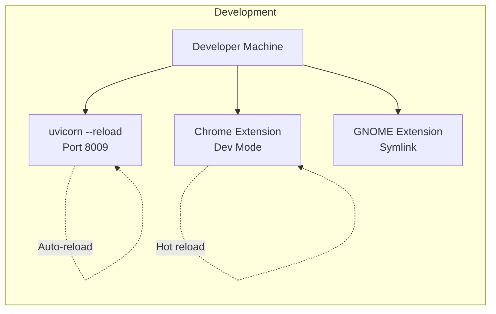
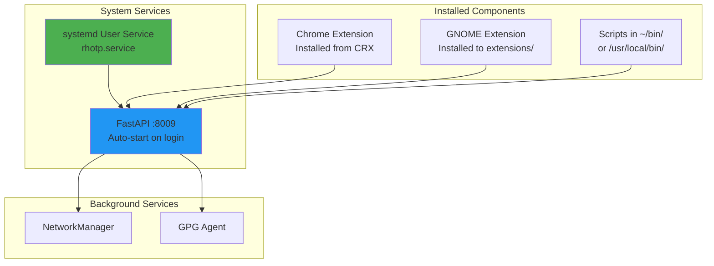
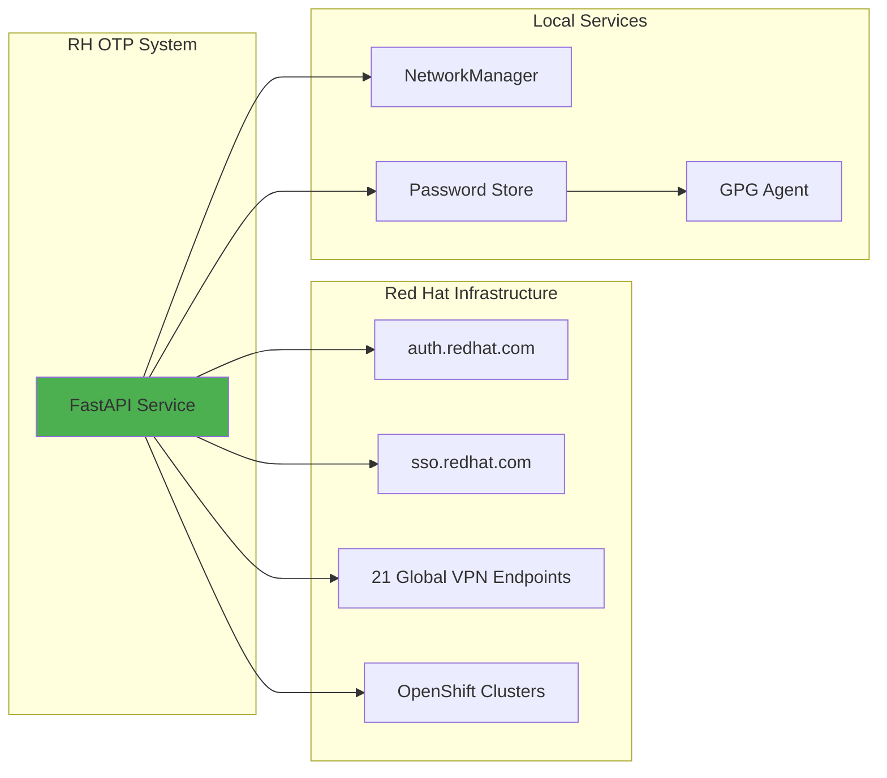
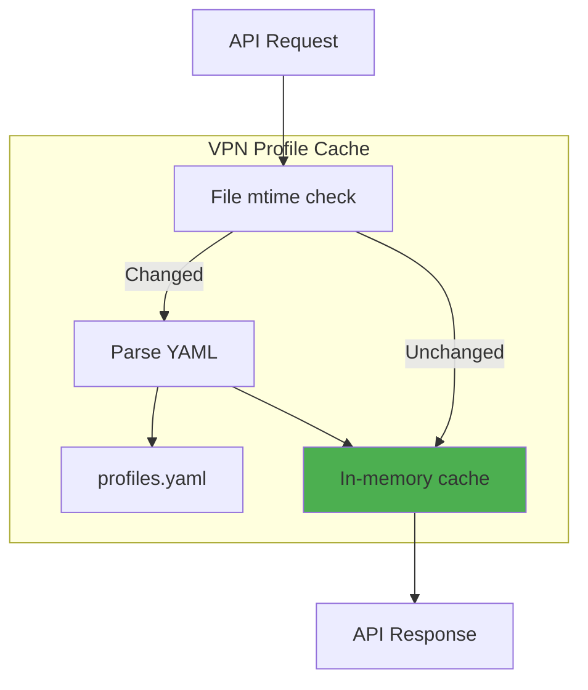

# Architecture Overview

## System Architecture



## Component Overview

### 1. FastAPI Service (Port 8009)

**Core application** providing REST API for all operations:
- **VPN Management**: Connect, disconnect, profile management
- **Ephemeral Namespaces**: Bonfire integration for OpenShift environments
- **Credential Management**: HOTP token generation, password retrieval
- **Authentication**: Bearer token-based security

**Technology**:
- FastAPI (Python async web framework)
- Uvicorn (ASGI server)
- Modular routing (vpn, ephemeral, legacy)

---

### 2. VPN Management System

**Components**:
- **FastAPI Routes** (`api/routes/vpn.py`): REST endpoints
- **VPN Service** (`services/vpn.py`): Business logic
- **Profile Manager** (`vpn-profile-manager`): CLI tool
- **Connection Scripts** (`vpn-connect`, `vpn-connect-shuttle`): Bash wrappers

**Capabilities**:
- 21 global VPN endpoints (Red Hat infrastructure)
- Profile-based configuration (YAML)
- NetworkManager integration
- Default profile management

---

### 3. Password Store Integration

**Components**:
- **Password Store Service** (`services/password_store.py`)
- **GPG Integration**: Encrypted credential storage
- **HOTP Token Generation**: RFC 4226 compliant

**Secrets Structure**:
```
~/.password-store/redhat.com/
├── username
├── associate-password
├── hotp-secret
├── hotp-counter
└── nm-uuid
```

---

### 4. Chrome Extension

**Components**:
- **Manifest V3 Extension** (`rh-otp/`)
- **Native Messaging Host** (`rh-otp/native_host.py`)
- **Background Service Worker** (`background.js`)
- **Content Scripts** (`contentscript.js`)

**Capabilities**:
- Auto-login to Red Hat SSO
- One-click password retrieval
- Ephemeral environment integration
- Native token access (secure bridge)

---

### 5. GNOME Shell Extension

**Components**:
- **Extension Core** (`rh-otp-gnome/extension.js`)
- **Preferences UI** (`rh-otp-gnome/prefs.js`)
- **GSettings Schema**: Configuration storage

**Capabilities**:
- System tray integration
- VPN profile menu (21 endpoints)
- Real-time status monitoring
- Desktop notifications
- Password clipboard integration

---

### 6. Ephemeral Namespace Management

**Components**:
- **Ephemeral Service** (`services/ephemeral.py`)
- **Bonfire CLI Integration**: Namespace operations
- **OpenShift Integration**: `oc` and `kubectl` commands

**Capabilities**:
- Namespace listing and filtering
- Namespace extension (duration management)
- Password retrieval from Kubernetes secrets
- Route discovery
- Cache management

---

### 7. OpenShift Token Tool

**Component**: `rhtoken` (Selenium-based automation)

**Capabilities**:
- Auto-install ChromeDriver
- Automated browser login
- Token extraction from OAuth pages
- Support for 6 environments
- KUBECONFIG integration

---

## Data Flow

### VPN Connection Flow



---

### Chrome Extension Authentication Flow



---

### Ephemeral Namespace Extension



---

## Security Architecture

### Authentication Layers



### Password Store Encryption



---

## Deployment Architecture

### Development Mode



### Production Mode



---

## Technology Stack

### Backend

| Component | Technology | Version |
|-----------|-----------|---------|
| Framework | FastAPI | Latest |
| Server | Uvicorn | Latest |
| Language | Python 3 | 3.8+ |
| Async | asyncio | Built-in |

### Frontend

| Component | Technology | Version |
|-----------|-----------|---------|
| Chrome Extension | Manifest V3 | Latest |
| GNOME Extension | GJS (JavaScript) | GNOME 3.36-49+ |
| CLI Tools | Bash, Python 3 | Latest |

### Services

| Service | Purpose | Protocol |
|---------|---------|----------|
| NetworkManager | VPN connections | D-Bus/nmcli |
| Password Store | Credential storage | GPG encryption |
| Bonfire | Ephemeral namespaces | CLI subprocess |
| OpenShift | Kubernetes access | oc/kubectl |

### Security

| Component | Technology | Purpose |
|-----------|-----------|---------|
| Authentication | Bearer Tokens | API security |
| Encryption | GPG | Password storage |
| Native Messaging | Chrome Protocol | Token bridge |
| HOTP | RFC 4226 | OTP generation |

---

## File Structure

```
rh-otp-auto-connect/
├── src/
│   ├── main.py                      # FastAPI application
│   ├── api/
│   │   ├── routes/
│   │   │   ├── vpn.py              # VPN endpoints (17 routes)
│   │   │   ├── ephemeral.py        # Ephemeral namespace endpoints
│   │   │   └── legacy.py           # Backward compatibility
│   │   ├── models/                  # Pydantic models
│   │   └── dependencies/
│   │       ├── auth.py             # Bearer token verification
│   │       └── common.py           # Shared utilities
│   ├── services/
│   │   ├── vpn.py                  # VPN business logic
│   │   ├── ephemeral.py            # Bonfire integration
│   │   └── password_store.py       # GPG credential access
│   ├── vpn-profiles/
│   │   ├── profiles.yaml           # 21 VPN endpoints config
│   │   ├── templates/              # Jinja2 templates
│   │   └── certs/                  # Red Hat CA bundle
│   ├── vpn-connect                 # VPN connection script
│   ├── vpn-connect-shuttle         # Alternative VPN (SSH tunnel)
│   ├── vpn-profile-manager         # VPN CLI management tool
│   ├── rhtoken                     # OpenShift token automation
│   ├── rh-otp/                     # Chrome extension
│   │   ├── manifest.json           # Manifest V3
│   │   ├── background.js           # Service worker
│   │   ├── contentscript.js        # Auto-login
│   │   ├── popup.html/js           # Extension UI
│   │   └── native_host.py          # Native messaging
│   └── rh-otp-gnome/               # GNOME Shell extension
│       ├── extension.js            # Main logic
│       ├── prefs.js                # Settings UI
│       └── schemas/                # GSettings schema
├── docs/                            # Documentation
│   ├── ARCHITECTURE.md             # This file
│   ├── API.md                      # API reference
│   ├── USER_GUIDE.md               # User documentation
│   ├── DEVELOPER_GUIDE.md          # Developer docs
│   └── drawings/                   # Diagrams
├── plans/                           # Design documents
├── tests/                           # Test suite
├── Makefile                         # Build automation
└── pyproject.toml                  # Python config
```

---

## API Endpoints Summary

### VPN Management (17 endpoints)

| Method | Endpoint | Purpose |
|--------|----------|---------|
| GET | `/vpn/profiles` | List all 21 VPN profiles |
| GET | `/vpn/profiles/{id}` | Get specific profile |
| GET | `/vpn/default` | Get default VPN UUID |
| POST | `/vpn/default` | Set default VPN |
| POST | `/vpn/connect/default` | Connect to default VPN |
| POST | `/vpn/connect/{id}` | Connect to specific profile |
| POST | `/vpn/disconnect` | Disconnect active VPN |
| GET | `/vpn/status` | Get connection status |

### Ephemeral Namespaces (4 endpoints)

| Method | Endpoint | Purpose |
|--------|----------|---------|
| GET | `/ephemeral/namespace/details` | Get namespace info |
| GET | `/ephemeral/namespace/status` | Check namespace exists |
| POST | `/ephemeral/namespace/extend` | Extend reservation |
| POST | `/ephemeral/namespace/clear-cache` | Refresh data |

### Legacy/Credentials (2 endpoints)

| Method | Endpoint | Purpose |
|--------|----------|---------|
| GET | `/get_creds` | Get username + password + OTP |
| GET | `/get_associate_email` | Get user email |

---

## Integration Points

### External Services



---

## Performance Characteristics

### Response Times

| Operation | Typical Time | Notes |
|-----------|-------------|-------|
| Get credentials | ~100ms | Includes HOTP generation |
| List VPN profiles | ~50ms | Cached YAML parsing |
| VPN connect | ~3-5s | NetworkManager negotiation |
| Namespace extend | ~2-3s | Bonfire CLI execution |
| Token generation (rhtoken) | ~15-30s | Browser automation |

### Caching Strategy



---

## Future Architecture

### Planned Enhancements

```mermaid
graph TB
    subgraph "Current"
        Current[FastAPI Service<br/>VPN + Ephemeral]
    end

    subgraph "Phase 1: Namespace Lifecycle"
        Reserve[namespace/reserve]
        Release[namespace/release]
        Describe[namespace/describe]
    end

    subgraph "Phase 2: Deployment"
        Deploy[deploy/<apps>]
        Status[deploy/status]
        Wait[deploy/wait]
    end

    subgraph "Phase 3: Monitoring"
        Resources[resources/*]
        Health[health]
        Pods[pods/*]
    end

    Current --> Reserve
    Current --> Release
    Current --> Describe

    Reserve --> Deploy
    Release --> Deploy
    Describe --> Deploy

    Deploy --> Status
    Status --> Resources
    Wait --> Health
```

See `plans/bonfire_feature_proposal.md` for detailed roadmap.

---

## Related Documentation

- **[API Reference](API.md)** - Detailed endpoint documentation
- **[User Guide](USER_GUIDE.md)** - End-user documentation
- **[Developer Guide](DEVELOPER_GUIDE.md)** - Development setup and guidelines
- **[Diagrams](drawings/)** - Additional workflow diagrams
- **[Plans](../plans/)** - Feature proposals and design documents
