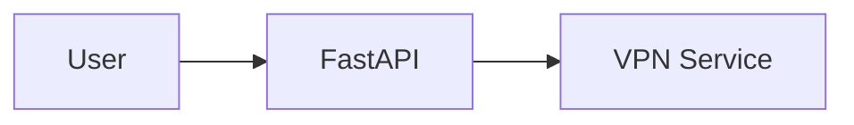

# Documentation Index

Welcome to the RH-OTP Auto-Connect documentation!

## 📚 Documentation Overview

This directory contains comprehensive documentation for the RH-OTP Auto-Connect system, including architecture diagrams, API reference, user guides, and developer documentation.

---

## 🗺️ Quick Navigation

### For Users

- **[User Guide](USER_GUIDE.md)** - Installation, configuration, and usage instructions
  - Quick start guide
  - VPN management
  - Chrome extension usage
  - GNOME extension features
  - Troubleshooting

### For Developers

- **[Developer Guide](DEVELOPER_GUIDE.md)** - Development setup and contribution guidelines
  - Development environment setup
  - Project structure
  - Testing and code quality
  - Contributing process
  - Release workflow

### For System Architects

- **[Architecture](ARCHITECTURE.md)** - System architecture overview
  - Component diagrams
  - Data flow diagrams
  - Security architecture
  - Technology stack
  - Integration points

### For API Users

- **[API Reference](API.md)** - Complete REST API documentation
  - All 17+ endpoints documented
  - Request/response examples
  - Authentication details
  - Error handling
  - Client examples (Python, Bash, JavaScript)

---

## 📊 Diagrams & Workflows

### VPN Workflows

**[VPN Workflows](drawings/VPN_WORKFLOWS.md)** - Detailed VPN connection flows

Contains 9 comprehensive diagrams:
1. Standard VPN connection (vpn-connect script)
2. VPN connection with specific profile (API)
3. VPN connection via GNOME extension
4. VPN disconnection flow
5. VPN status check flow
6. VPN profile listing with caching
7. Default VPN management (GET/SET)
8. Shuttle VPN connection (alternative method)
9. VPN profile installation (setup flow)

**Use cases**:
- Understanding VPN connection process
- Debugging connection issues
- Planning new VPN features

---

### Authentication Flows

**[Authentication Flows](drawings/AUTH_FLOWS.md)** - Security and credential management

Contains 12 comprehensive diagrams:
1. System initialization & token generation
2. Bearer token authentication (API requests)
3. Chrome extension token access (native messaging)
4. Password store access & HOTP generation
5. Chrome extension auto-login flow
6. Credential context switching (associate vs. ephemeral)
7. GNOME extension authentication
8. CLI script authentication
9. HOTP token generation (detailed)
10. Multi-client authentication architecture
11. Security attack surface graph
12. Authentication state machine

**Use cases**:
- Understanding security model
- Implementing new clients
- Auditing security practices

---

## 🎯 Use Case Scenarios

### Scenario 1: Connect to VPN

**Goal**: Connect to a specific Red Hat VPN endpoint

**Documentation path**:
1. [User Guide - VPN Management](USER_GUIDE.md#vpn-management) - Installation and basic usage
2. [VPN Workflows](drawings/VPN_WORKFLOWS.md) - Detailed connection flow
3. [API Reference - VPN Endpoints](API.md#vpn-management) - API usage

**Quick start**:
```bash
./vpn-connect                        # Connect to default
./vpn-profile-manager connect BRQ2   # Connect to specific profile
```

---

### Scenario 2: Develop a New Feature

**Goal**: Add a new API endpoint

**Documentation path**:
1. [Developer Guide - Development Setup](DEVELOPER_GUIDE.md#development-setup) - Environment setup
2. [Architecture](ARCHITECTURE.md) - Understanding system design
3. [Developer Guide - Contributing](DEVELOPER_GUIDE.md#contributing) - Adding endpoints
4. [API Reference](API.md) - Document new endpoint

**Steps**:
1. Create feature branch
2. Add Pydantic models
3. Add service logic
4. Add route handler
5. Write tests
6. Update documentation

---

### Scenario 3: Troubleshoot Connection Issue

**Goal**: Fix VPN connection failure

**Documentation path**:
1. [User Guide - Troubleshooting](USER_GUIDE.md#troubleshooting) - Common issues
2. [VPN Workflows](drawings/VPN_WORKFLOWS.md) - Connection flow
3. [Architecture - VPN Management](ARCHITECTURE.md#2-vpn-management-system) - System components

**Debugging steps**:
1. Check service status: `systemctl --user status rhotp`
2. View logs: `journalctl --user -u rhotp -f`
3. Verify NetworkManager: `nmcli connection show`
4. Test password store: `pass show redhat.com/username`

---

### Scenario 4: Integrate with Custom Tool

**Goal**: Call RH-OTP API from external script

**Documentation path**:
1. [API Reference](API.md) - Endpoint documentation
2. [Authentication Flows](drawings/AUTH_FLOWS.md) - Auth mechanism
3. [API Reference - Client Examples](API.md#client-examples) - Code samples

**Example**:
```python
import requests

TOKEN = open("~/.cache/rhotp/auth_token").read().strip()
response = requests.get(
    "http://localhost:8009/vpn/profiles",
    headers={"Authorization": f"Bearer {TOKEN}"}
)
```

---

## 📖 Documentation by Component

### FastAPI Service

- **[Architecture - FastAPI Service](ARCHITECTURE.md#1-fastapi-service-port-8009)**
- **[API Reference](API.md)** - All endpoints
- **[Developer Guide - Project Structure](DEVELOPER_GUIDE.md#project-structure)**

---

### VPN Management

- **[Architecture - VPN Management System](ARCHITECTURE.md#2-vpn-management-system)**
- **[VPN Workflows](drawings/VPN_WORKFLOWS.md)** - All workflows
- **[API Reference - VPN Endpoints](API.md#vpn-management)**
- **[User Guide - VPN Management](USER_GUIDE.md#vpn-management)**

---

### Chrome Extension

- **[Architecture - Chrome Extension](ARCHITECTURE.md#4-chrome-extension)**
- **[Authentication Flows - Chrome Extension](drawings/AUTH_FLOWS.md#5-chrome-extension-auto-login-flow)**
- **[User Guide - Chrome Extension](USER_GUIDE.md#chrome-extension)**

---

### GNOME Extension

- **[Architecture - GNOME Shell Extension](ARCHITECTURE.md#5-gnome-shell-extension)**
- **[Authentication Flows - GNOME Extension](drawings/AUTH_FLOWS.md#7-gnome-extension-authentication)**
- **[User Guide - GNOME Extension](USER_GUIDE.md#gnome-extension)**

---

### Ephemeral Namespaces

- **[Architecture - Ephemeral Namespace Management](ARCHITECTURE.md#6-ephemeral-namespace-management)**
- **[API Reference - Ephemeral Endpoints](API.md#ephemeral-namespace-management)**
- **[User Guide - Ephemeral Namespaces](USER_GUIDE.md#ephemeral-namespaces)**

---

## 🔍 Finding Information

### By Topic

| Topic | Documentation |
|-------|---------------|
| Installation | [User Guide - Installation](USER_GUIDE.md#installation) |
| VPN Setup | [User Guide - VPN Management](USER_GUIDE.md#vpn-management) |
| API Usage | [API Reference](API.md) |
| Development Setup | [Developer Guide - Development Setup](DEVELOPER_GUIDE.md#development-setup) |
| Architecture | [Architecture](ARCHITECTURE.md) |
| Troubleshooting | [User Guide - Troubleshooting](USER_GUIDE.md#troubleshooting) |
| Security | [Architecture - Security Architecture](ARCHITECTURE.md#security-architecture) |
| Testing | [Developer Guide - Testing](DEVELOPER_GUIDE.md#testing) |

---

### By Diagram Type

| Diagram Type | Location |
|--------------|----------|
| System Architecture | [Architecture - System Architecture](ARCHITECTURE.md#system-architecture) |
| Sequence Diagrams | [VPN Workflows](drawings/VPN_WORKFLOWS.md), [Auth Flows](drawings/AUTH_FLOWS.md) |
| Data Flow | [Architecture - Data Flow](ARCHITECTURE.md#data-flow) |
| State Machines | [Auth Flows - Authentication State Machine](drawings/AUTH_FLOWS.md#authentication-state-machine) |
| Component Interactions | [Architecture](ARCHITECTURE.md) |

---

## 📝 Documentation Standards

### Mermaid Diagrams

All diagrams use **Mermaid** syntax, which renders natively in GitHub:



**Diagram types used**:
- `graph TB/LR` - Flowcharts and architecture
- `sequenceDiagram` - Interaction flows
- `stateDiagram-v2` - State machines

**Benefits**:
- ✅ Renders in GitHub README files
- ✅ No external tools needed
- ✅ Version-controlled as text
- ✅ Easy to update

---

### Documentation Format

**File naming**:
- `UPPERCASE.md` - Main documentation files
- `lowercase.md` - Supplementary files
- `CATEGORY_DETAIL.md` - Organized by category

**Section structure**:
- Clear table of contents
- Hierarchical headers (H1 → H6)
- Code examples with syntax highlighting
- Links to related documentation

**Code examples**:
- Include language identifier for syntax highlighting
- Show both success and error cases
- Provide context and explanation

---

## 🔄 Keeping Documentation Updated

### When to Update Documentation

**Always update documentation when**:
- ✅ Adding new API endpoints
- ✅ Changing endpoint behavior
- ✅ Adding new components
- ✅ Modifying architecture
- ✅ Adding new workflows

**Documentation updates should be**:
- Part of the same PR as code changes
- Reviewed alongside code
- Tested for accuracy

---

## 🤝 Contributing to Documentation

### How to Contribute

1. **Identify gaps** - Missing information or unclear explanations
2. **Create issue** - Describe what needs improvement
3. **Make changes** - Update relevant files
4. **Add diagrams** - Use Mermaid for visual clarity
5. **Test locally** - Verify markdown renders correctly
6. **Submit PR** - Include documentation in code PRs

### Documentation Checklist

- [ ] Updated relevant documentation files
- [ ] Added/updated diagrams if needed
- [ ] Included code examples
- [ ] Linked to related documentation
- [ ] Tested markdown rendering
- [ ] Updated table of contents (if applicable)

---

## 📊 Documentation Statistics

| Document | Lines | Diagrams | Purpose |
|----------|-------|----------|---------|
| ARCHITECTURE.md | ~600 | 9 | System overview |
| API.md | ~800 | 0 | API reference |
| USER_GUIDE.md | ~700 | 0 | End-user guide |
| DEVELOPER_GUIDE.md | ~650 | 0 | Developer guide |
| VPN_WORKFLOWS.md | ~750 | 9 | VPN diagrams |
| AUTH_FLOWS.md | ~650 | 12 | Auth diagrams |
| **Total** | **~4,150 lines** | **30+ diagrams** | **Complete coverage** |

---

## 🎯 Next Steps

### For New Users

1. Read [User Guide](USER_GUIDE.md)
2. Follow [Quick Start](USER_GUIDE.md#quick-start)
3. Explore [VPN Management](USER_GUIDE.md#vpn-management)
4. Check [Troubleshooting](USER_GUIDE.md#troubleshooting) if issues arise

### For Developers

1. Read [Developer Guide](DEVELOPER_GUIDE.md)
2. Setup [Development Environment](DEVELOPER_GUIDE.md#development-setup)
3. Review [Architecture](ARCHITECTURE.md)
4. Check [Contributing Guidelines](DEVELOPER_GUIDE.md#contributing)

### For API Users

1. Read [API Reference](API.md)
2. Review [Authentication](drawings/AUTH_FLOWS.md)
3. Try [Client Examples](API.md#client-examples)
4. Explore [OpenAPI Docs](API.md#openapi-documentation) at http://localhost:8009/docs

---

## 📞 Getting Help

**Documentation issues**:
- File an issue on GitHub
- Tag with `documentation` label

**Questions**:
- Check [FAQ](USER_GUIDE.md#faq)
- Search existing GitHub issues
- Ask in project discussions

**Bugs**:
- Check [Troubleshooting](USER_GUIDE.md#troubleshooting)
- File bug report with logs

---

## 🔗 External Resources

- **FastAPI Documentation**: https://fastapi.tiangolo.com/
- **Mermaid Documentation**: https://mermaid.js.org/
- **Pass Documentation**: https://www.passwordstore.org/
- **NetworkManager**: https://networkmanager.dev/
- **Bonfire Documentation**: https://github.com/RedHatInsights/bonfire

---

## 📜 License

This documentation is part of the RH-OTP Auto-Connect project.

---

**Last Updated**: 2025-01-14

**Documentation Version**: 2.0.0
