# Authentication Flows

## Overview

This document details all authentication and credential management flows in the RH-OTP system.

---

## 1. System Initialization & Token Generation

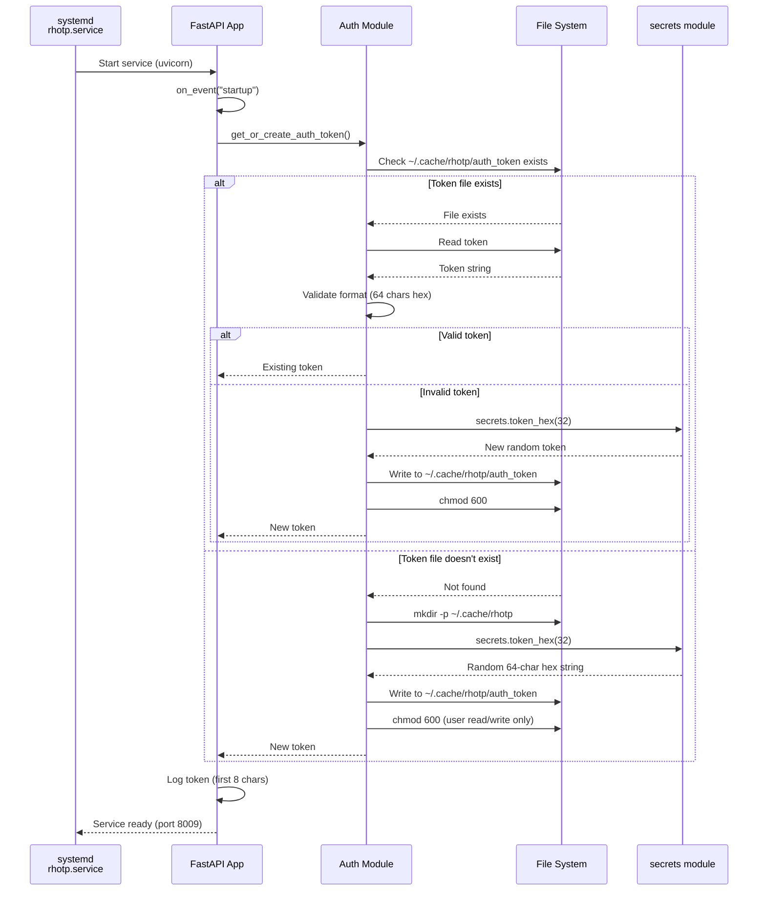

---

## 2. Bearer Token Authentication (API Requests)

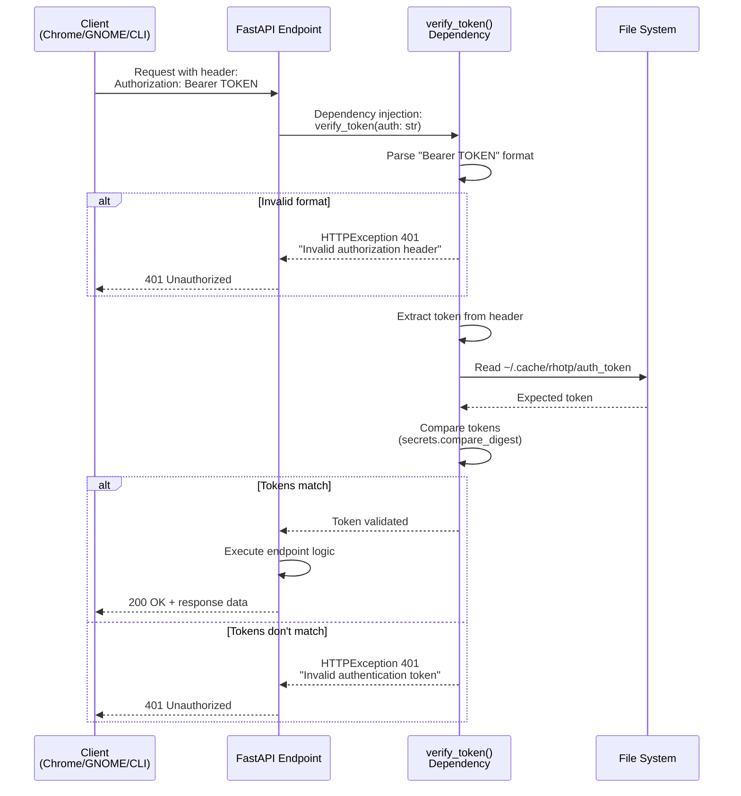

---

## 3. Chrome Extension Token Access (Native Messaging)

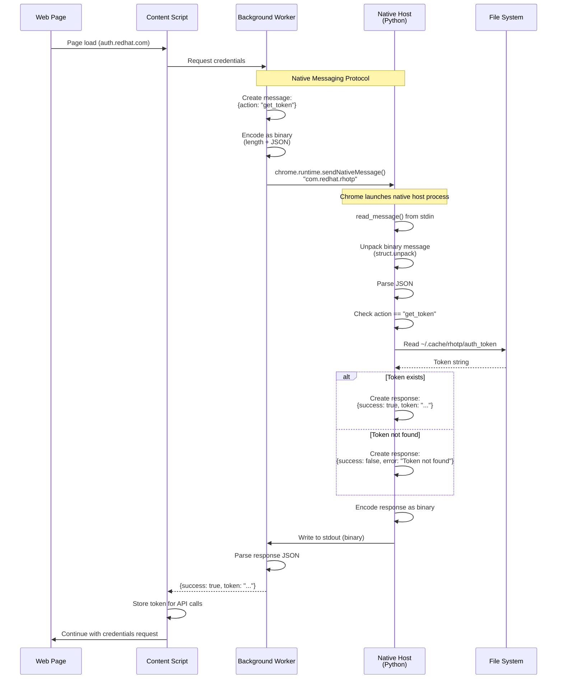

---

## 4. Password Store Access & HOTP Generation

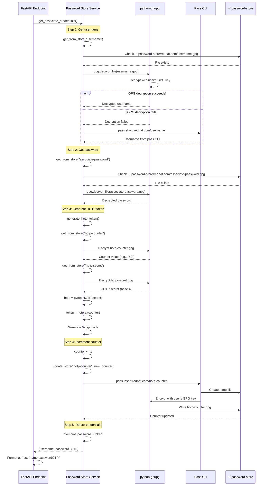

---

## 5. Chrome Extension Auto-Login Flow

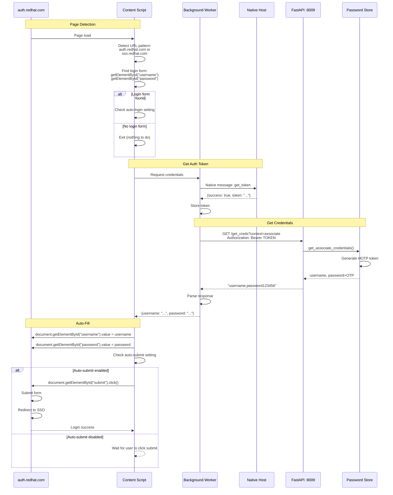

---

## 6. Credential Context Switching (Associate vs Ephemeral)

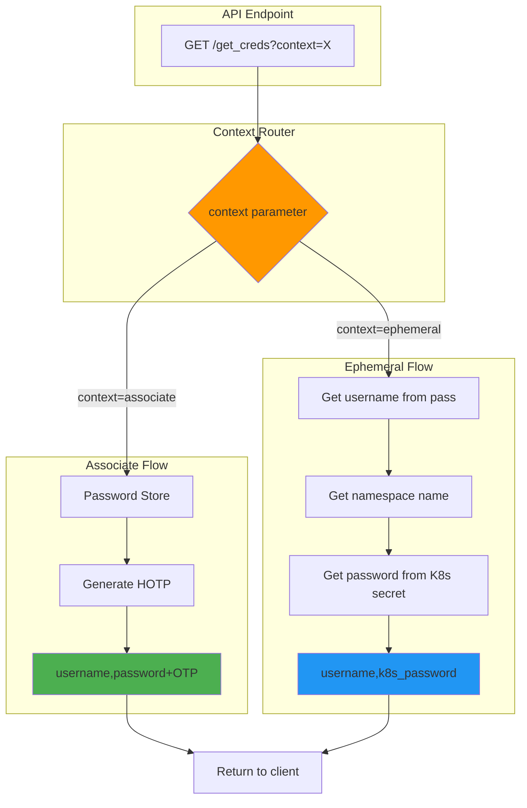

---

## 7. GNOME Extension Authentication

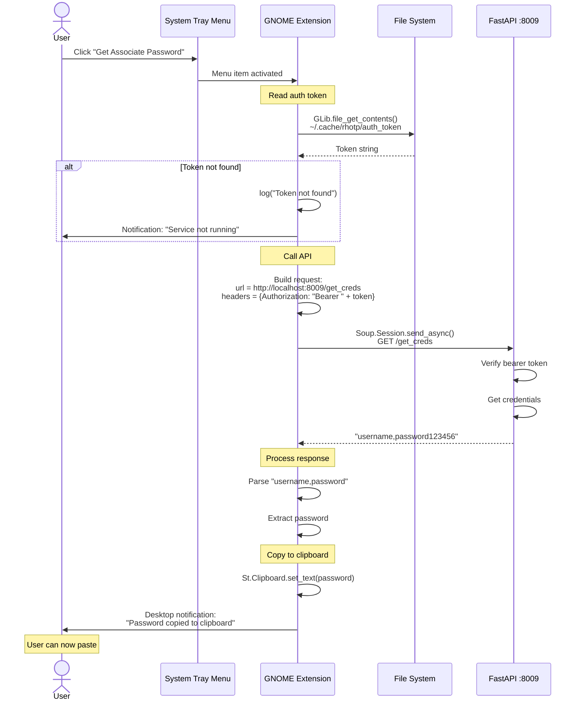

---

## 8. CLI Script Authentication

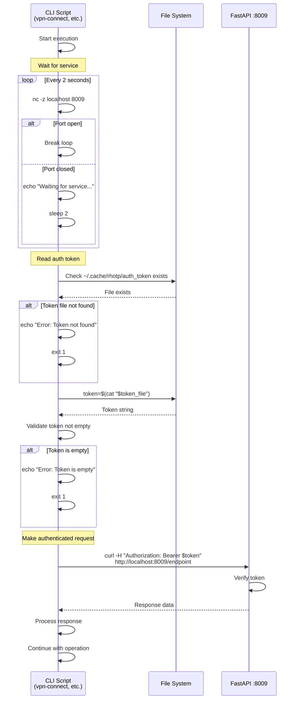

---

## 9. HOTP Token Generation Detail

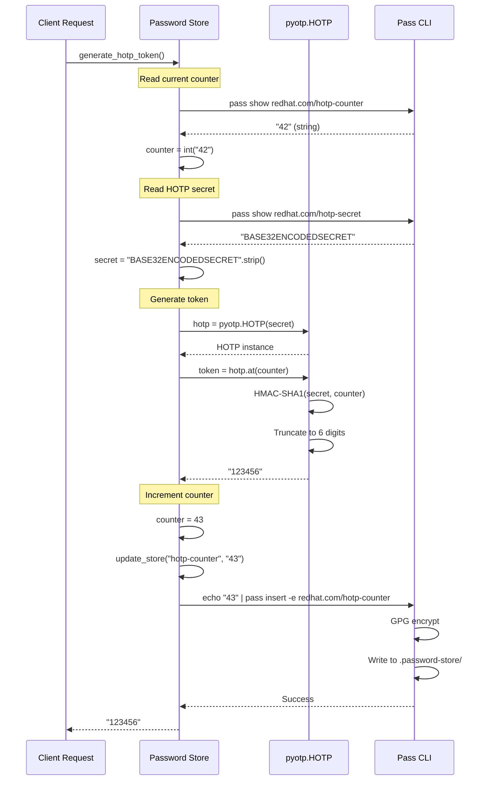

---

## 10. Multi-Client Authentication Architecture

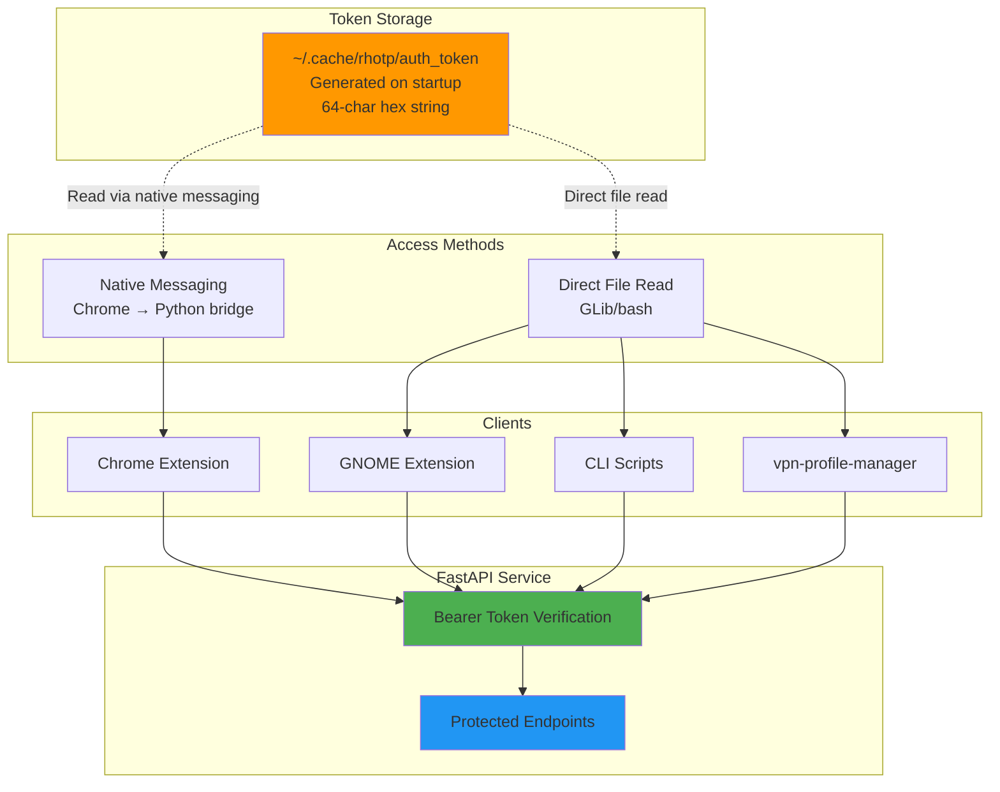

---

## Security Characteristics

### Token Security

| Aspect | Implementation | Security Level |
|--------|---------------|----------------|
| **Generation** | `secrets.token_hex(32)` | Cryptographically secure random |
| **Storage** | `~/.cache/rhotp/auth_token` | User-only access (chmod 600) |
| **Transmission** | HTTP headers (localhost) | Local-only, no network exposure |
| **Validation** | `secrets.compare_digest()` | Timing-attack resistant |
| **Rotation** | On service restart | Automatic invalidation |

### Password Store Security

| Aspect | Implementation | Security Level |
|--------|---------------|----------------|
| **Encryption** | GPG with user's key | Military-grade encryption |
| **HOTP Secret** | Stored encrypted | Never transmitted in clear |
| **HOTP Counter** | Auto-increment, encrypted | Single-use tokens |
| **Temp Files** | `chmod 600`, immediate deletion | Minimal exposure window |
| **API Access** | Bearer token required | Authenticated access only |

### Attack Surface

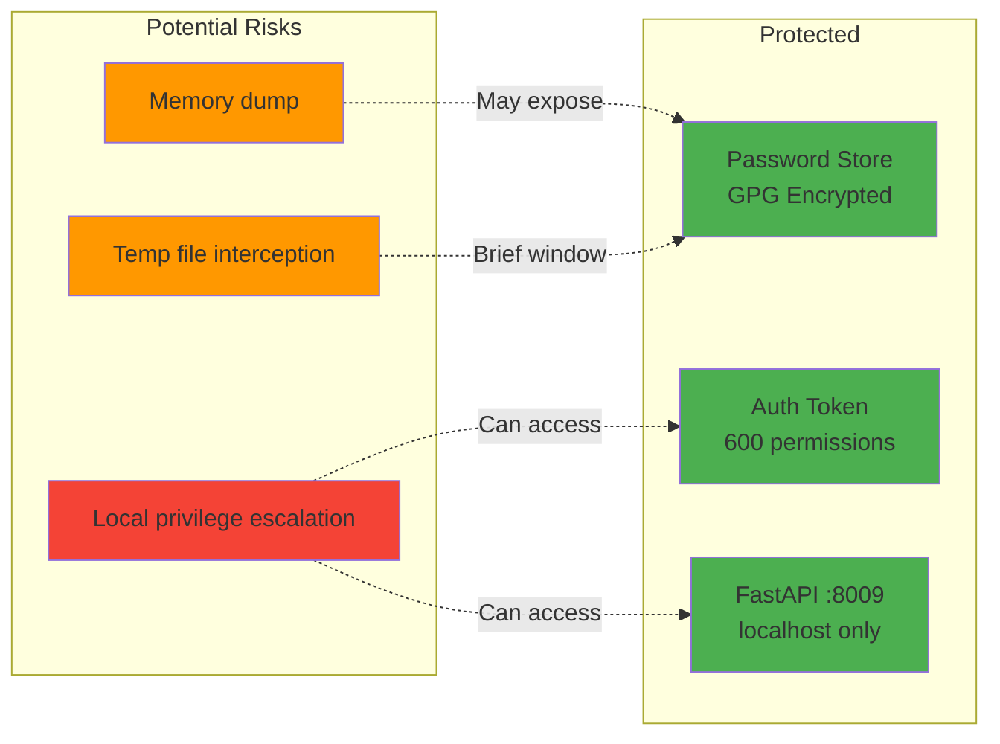

**Mitigations**:
- ✅ No network exposure (localhost only)
- ✅ User-only file permissions
- ✅ Encrypted credential storage
- ✅ Temporary files immediately deleted
- ✅ Single-use HOTP tokens
- ⚠️ Relies on OS user isolation
- ⚠️ Assumes trusted local environment

---

## Authentication State Machine

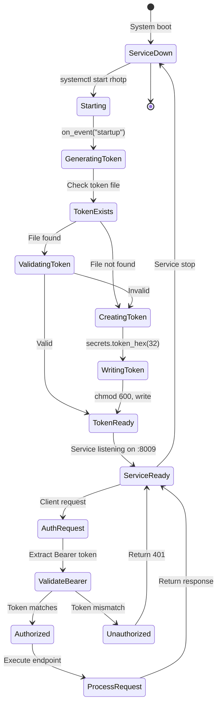

---

## Related Documentation

- **[Architecture Overview](../ARCHITECTURE.md)** - System architecture
- **[VPN Workflows](VPN_WORKFLOWS.md)** - VPN connection flows
- **[API Reference](../API.md)** - Endpoint documentation
- **[User Guide](../USER_GUIDE.md)** - End-user instructions
