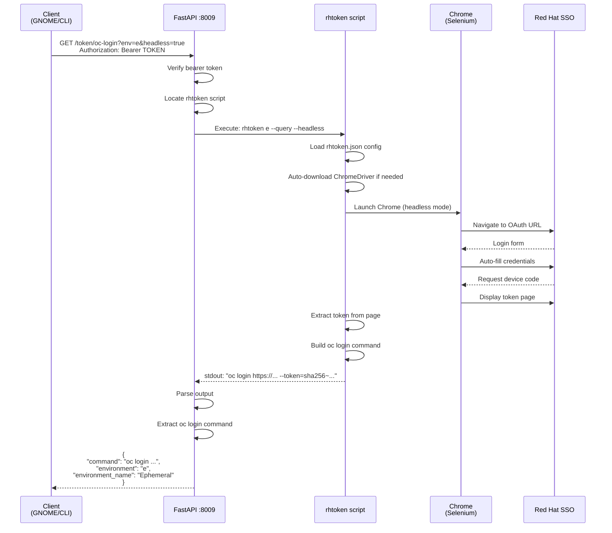
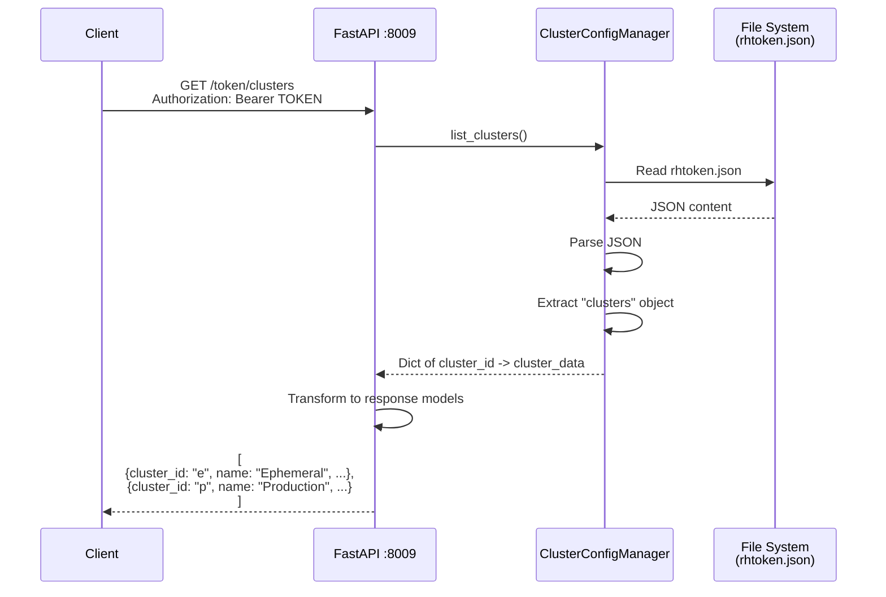
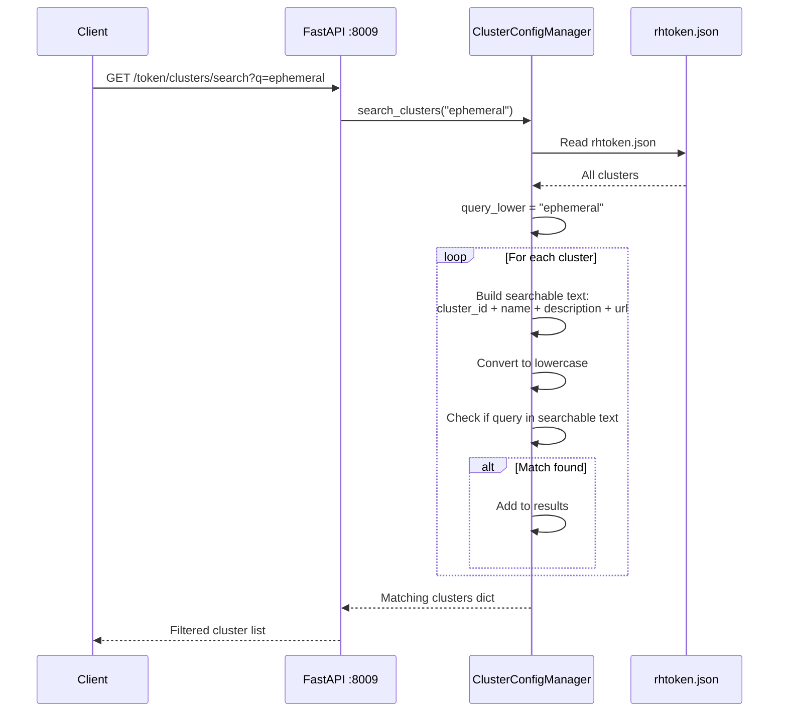
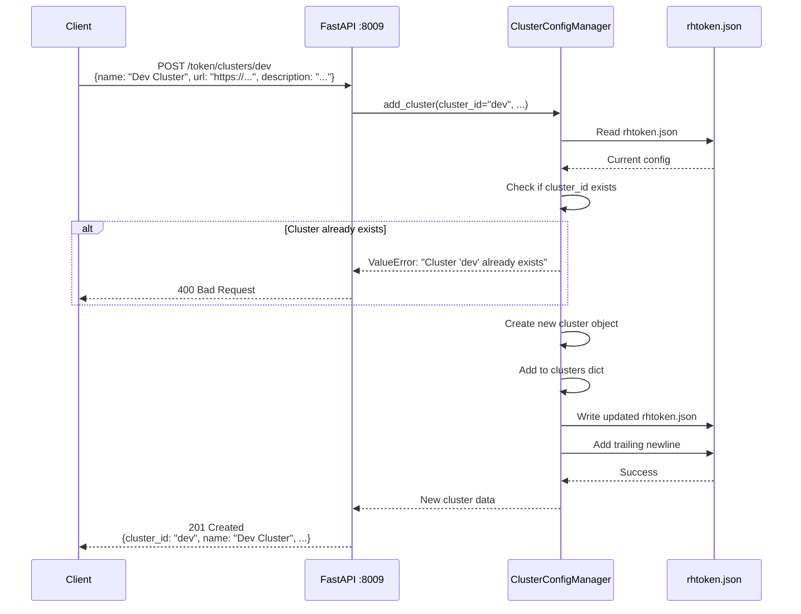
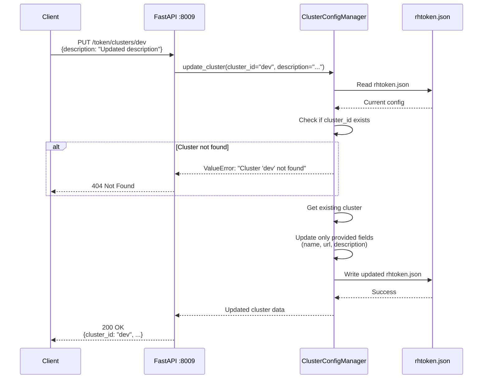
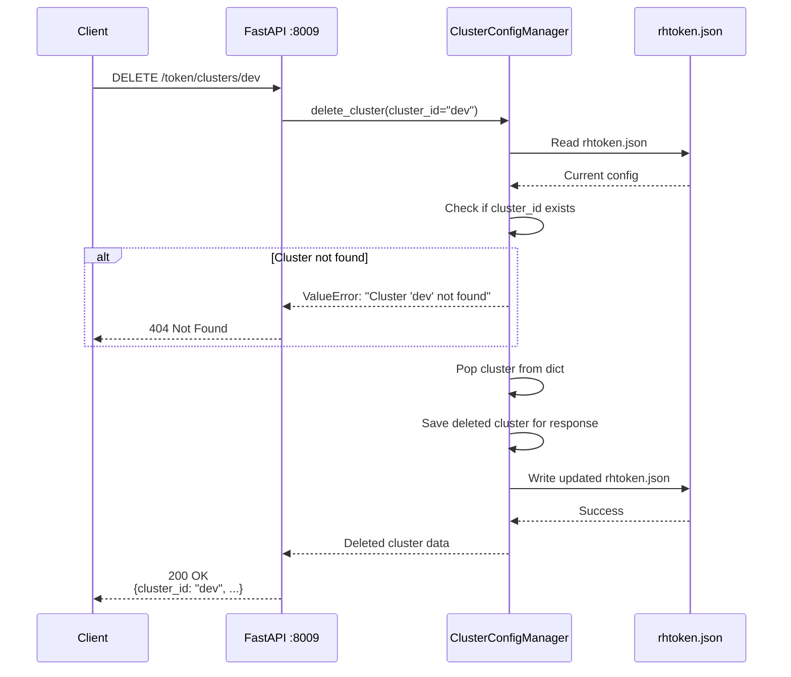
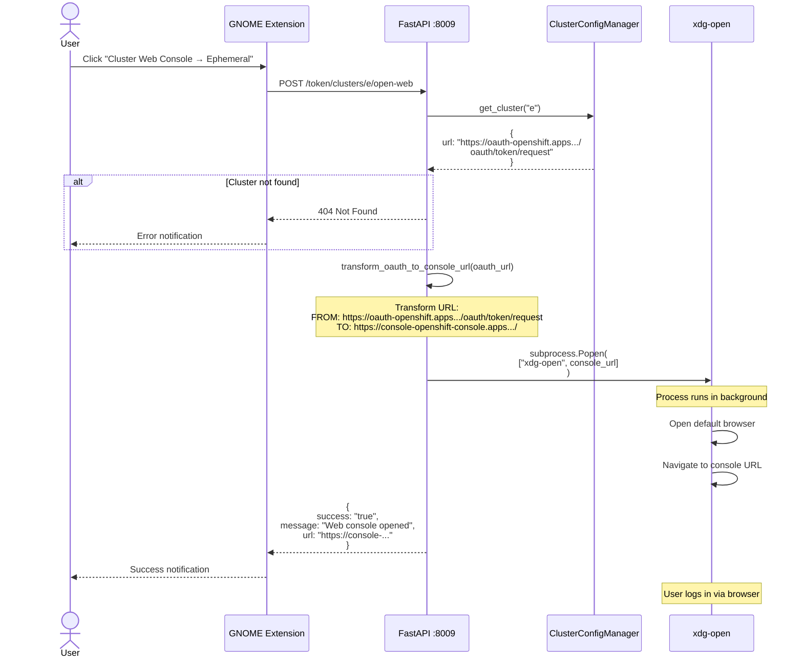
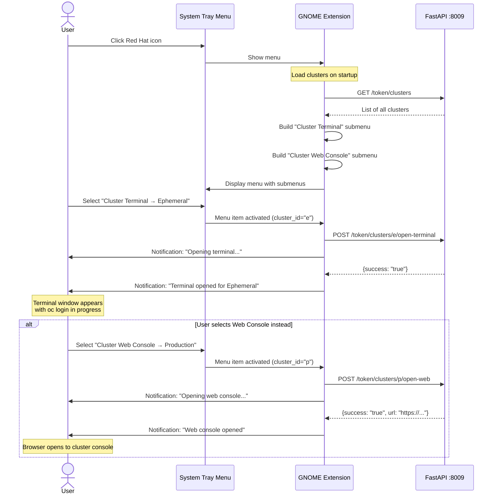
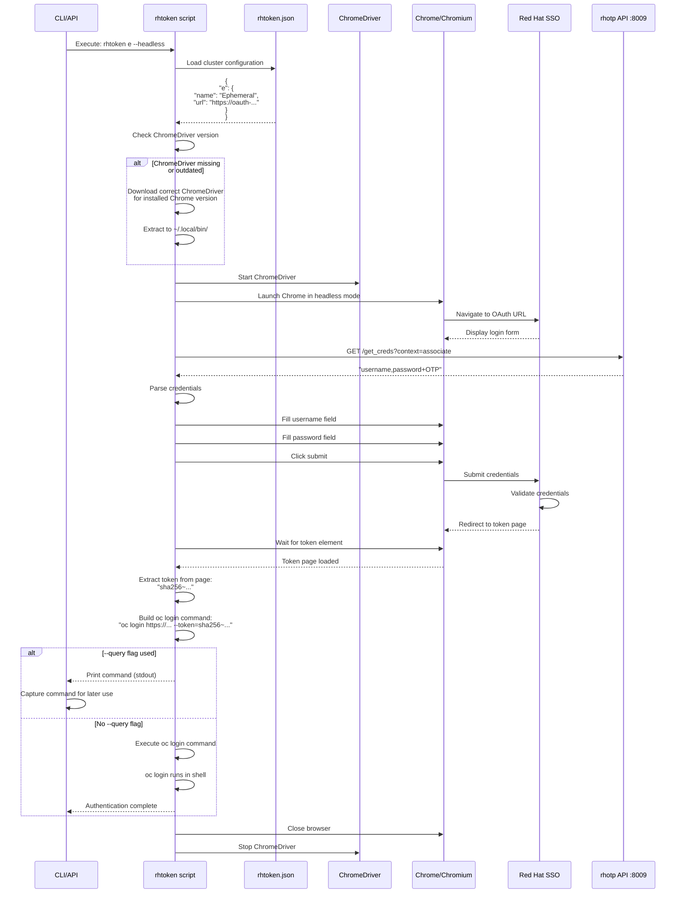
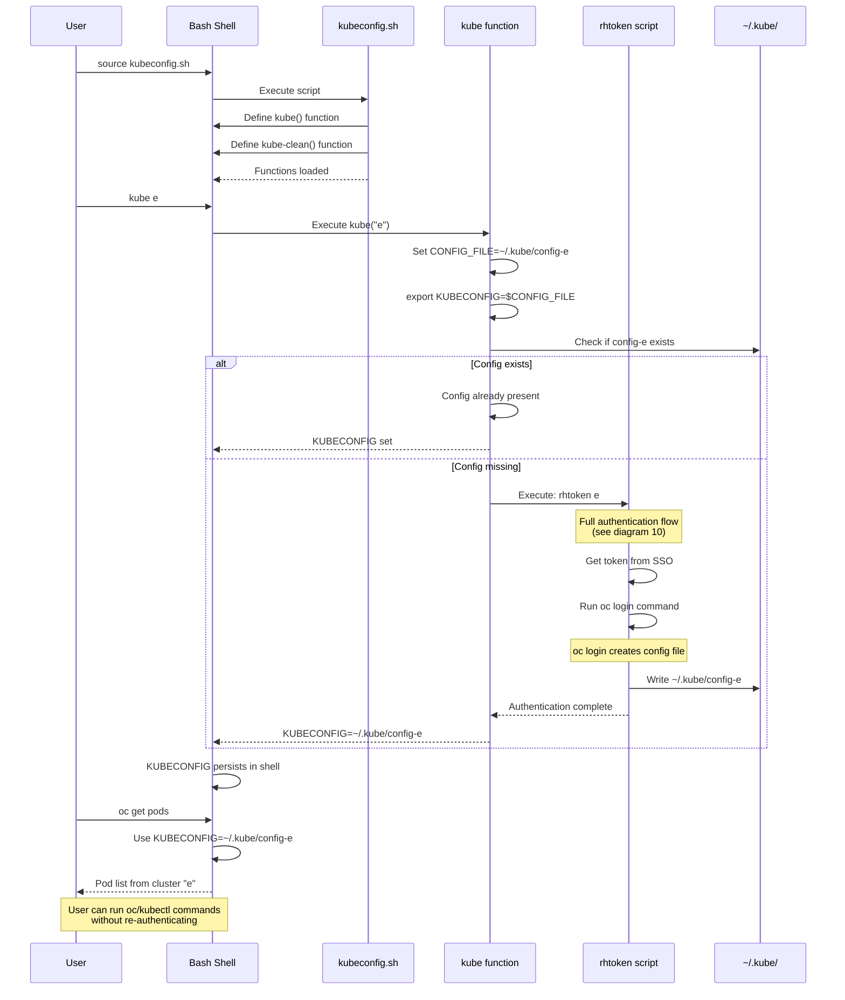

# OpenShift Cluster Management Workflows

## Overview

This document details all OpenShift cluster management and token acquisition workflows in the RH-OTP system.

---

## 1. Get OC Login Command



---

## 2. List All Clusters



---

## 3. Search Clusters



---

## 4. Add New Cluster



---

## 5. Update Cluster



---

## 6. Delete Cluster



---

## 7. Open Cluster Terminal

```mermaid
sequenceDiagram
    actor User
    participant GNOME as GNOME Extension
    participant API as FastAPI :8009
    participant Script as kubeconfig.sh
    participant Terminal as gnome-terminal
    participant Kube as kube function

    User->>GNOME: Click "Cluster Terminal → Ephemeral"
    GNOME->>API: POST /token/clusters/e/open-terminal

    API->>API: Locate kubeconfig.sh script

    alt Script not found
        API-->>GNOME: 404 Not Found
        GNOME-->>User: Error notification
    end

    API->>Terminal: subprocess.Popen(<br/>  ["gnome-terminal", "--", "bash", "-c",<br/>   "source kubeconfig.sh && kube-clean e && kube e; bash"]<br/>)

    Note over API,Terminal: Process runs in background<br/>(start_new_session=True)

    API-->>GNOME: {success: "true", message: "Terminal opened"}
    GNOME-->>User: Success notification

    Note over Terminal: Terminal window opens

    Terminal->>Script: source kubeconfig.sh
    Script->>Script: Define kube() function
    Script->>Script: Define kube-clean() function

    Terminal->>Kube: kube-clean e
    Kube->>Kube: Remove ~/.kube/config-e

    Terminal->>Kube: kube e
    Kube->>Kube: Set KUBECONFIG=~/.kube/config-e
    Kube->>Kube: Run rhtoken e (interactive)

    Note over Kube: Browser opens for authentication

    Kube->>Kube: Execute oc login command
    Kube-->>Terminal: Logged in to cluster

    Terminal->>Terminal: Drop to bash shell<br/>(KUBECONFIG still set)

    User->>Terminal: Run oc/kubectl commands
```

---

## 8. Open Cluster Web Console



---

## 9. GNOME Extension Integration Flow



---

## 10. rhtoken Script Workflow (Full Authentication)



---

## 11. Cluster Configuration File Structure

```mermaid
graph TB
    subgraph "rhtoken.json"
        Root[Root Object]
        Clusters[clusters: {}]

        Cluster_E[e: Ephemeral]
        Cluster_P[p: Production]
        Cluster_S[s: Stage]
        Cluster_AP[ap: App SRE Prod]
        Cluster_CP[cp: App SRE Stage]
        Cluster_K[k: Stone Prod]
    end

    subgraph "Cluster Object Structure"
        Name[name: string]
        Desc[description: string]
        URL[url: string<br/>OAuth token request URL]
    end

    Root --> Clusters
    Clusters --> Cluster_E
    Clusters --> Cluster_P
    Clusters --> Cluster_S
    Clusters --> Cluster_AP
    Clusters --> Cluster_CP
    Clusters --> Cluster_K

    Cluster_E --> Name
    Cluster_E --> Desc
    Cluster_E --> URL

    style Root fill:#4CAF50
    style Clusters fill:#2196F3
    style Name fill:#FF9800
    style Desc fill:#FF9800
    style URL fill:#FF9800
```

**Example rhtoken.json**:
```json
{
  "clusters": {
    "e": {
      "name": "Ephemeral",
      "description": "Ephemeral OpenShift environments",
      "url": "https://oauth-openshift.apps.crcs02ue1.urby.p1.openshiftapps.com/oauth/token/request"
    },
    "p": {
      "name": "Production",
      "description": "Production OpenShift cluster",
      "url": "https://oauth-openshift.apps.prod.example.com/oauth/token/request"
    }
  }
}
```

---

## 12. Kubeconfig Management Flow



---

## Key Workflow Characteristics

### Performance

| Workflow | Typical Duration | Blocking Operations |
|----------|------------------|---------------------|
| List clusters | 10ms | File read (rhtoken.json) |
| Search clusters | 15ms | File read + filtering |
| Get oc login command | 15-30 seconds | Browser automation, SSO login |
| Open terminal | 500ms | gnome-terminal spawn |
| Open web console | 200ms | xdg-open spawn |
| CRUD operations | 20-50ms | File read/write (rhtoken.json) |

### Security

| Workflow | Security Measures |
|----------|------------------|
| All API calls | Bearer token authentication |
| rhtoken.json | User-only read/write (chmod 600 recommended) |
| Browser automation | Headless mode, auto-close after token retrieval |
| Terminal spawning | User context, no privilege escalation |
| Web console | Opens in user's default browser (sandboxed) |

### Reliability

| Workflow | Failure Handling |
|----------|------------------|
| ChromeDriver download | Auto-detection and installation |
| SSO authentication | Timeout after 60 seconds |
| Config file operations | Validation, error messages on parse failures |
| Process spawning | Background execution (non-blocking) |
| Missing clusters | 404 errors with clear messages |

---

## Environment Identifiers

| ID | Environment Name | Description |
|----|-----------------|-------------|
| `e` | Ephemeral | Temporary development/testing environments |
| `p` | Production | Production OpenShift cluster |
| `s` | Stage | Staging environment |
| `ap` | App SRE Production | Application SRE production cluster |
| `cp` | App SRE Stage | Application SRE staging cluster |
| `k` | Stone Production | Stone production cluster |

---

## Related Documentation

- **[API Reference](../API.md)** - Complete API endpoint documentation
- **[VPN Workflows](VPN_WORKFLOWS.md)** - VPN connection diagrams
- **[Authentication Flows](AUTH_FLOWS.md)** - Authentication diagrams
- **[Architecture Overview](../ARCHITECTURE.md)** - System architecture
- **[User Guide](../USER_GUIDE.md)** - End-user instructions
