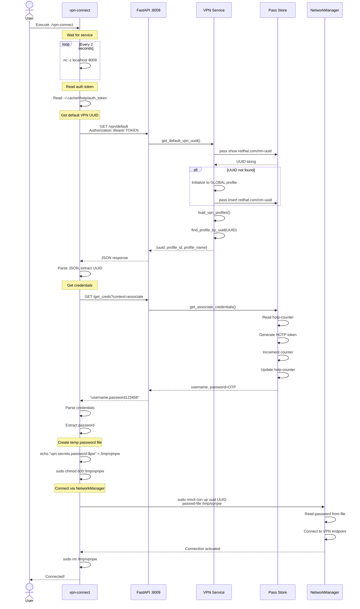
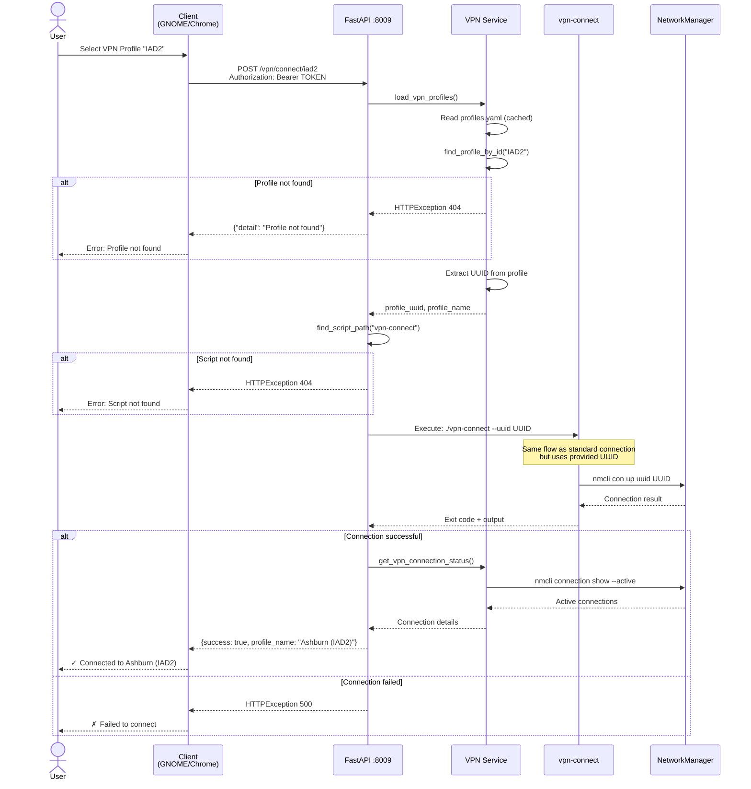
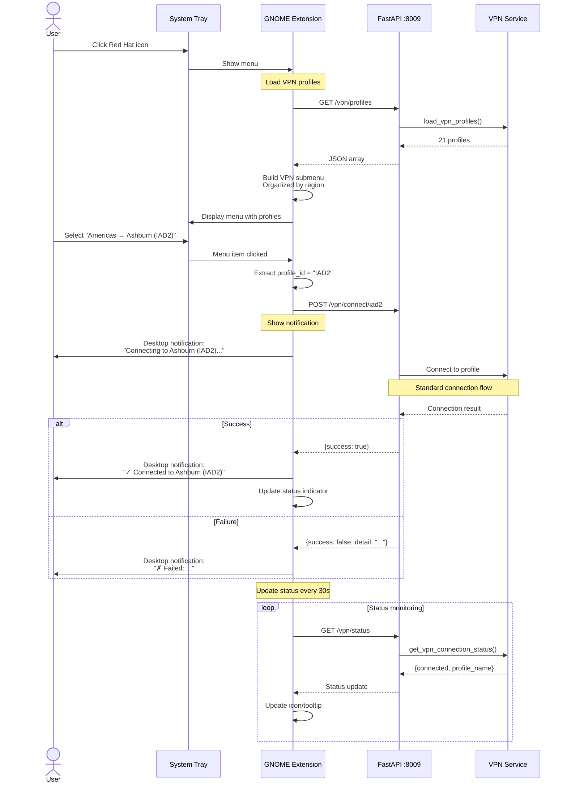
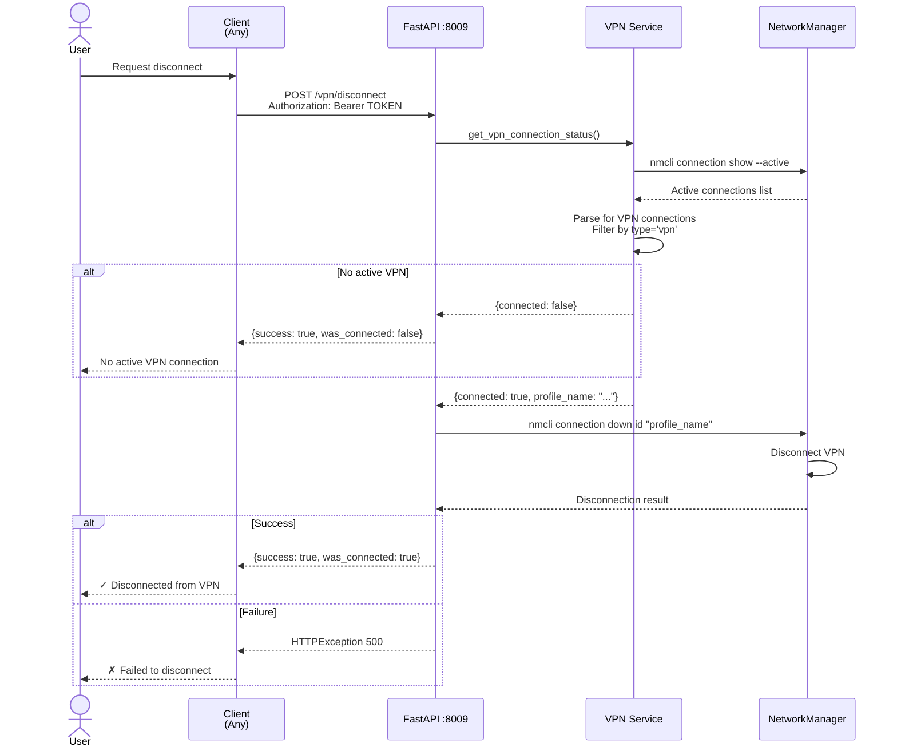
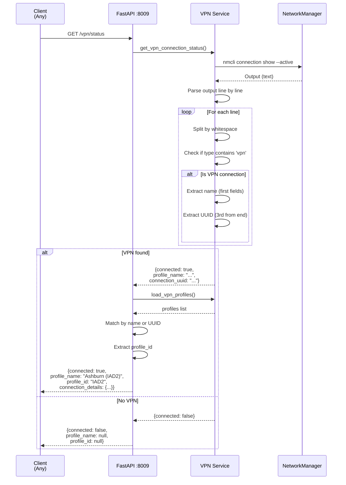
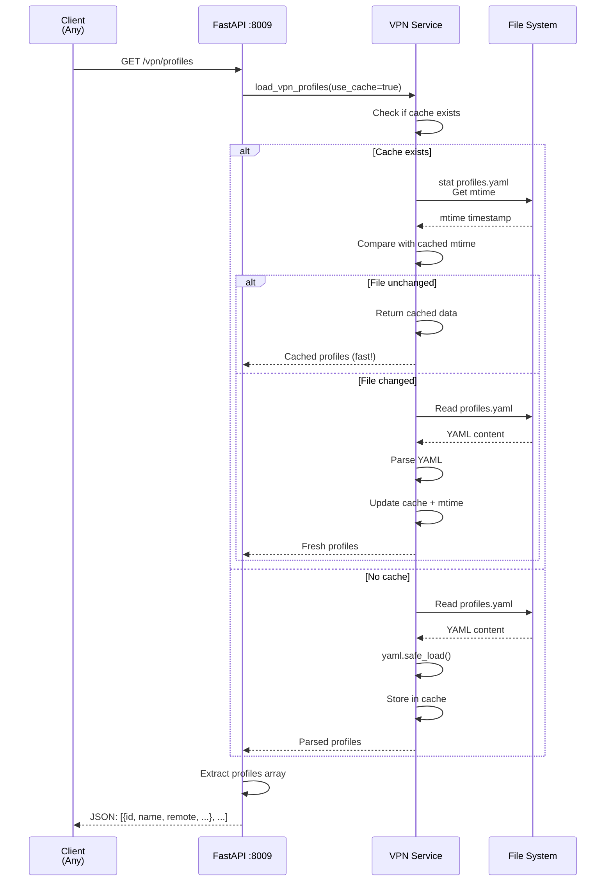
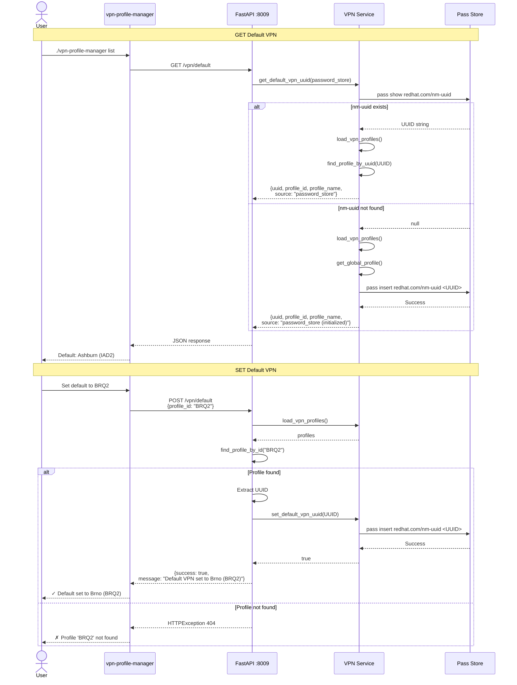
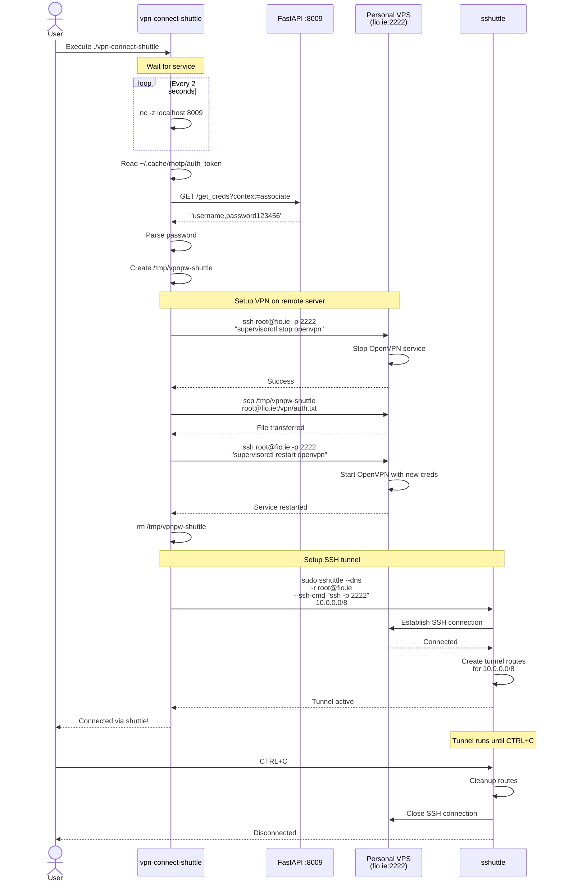
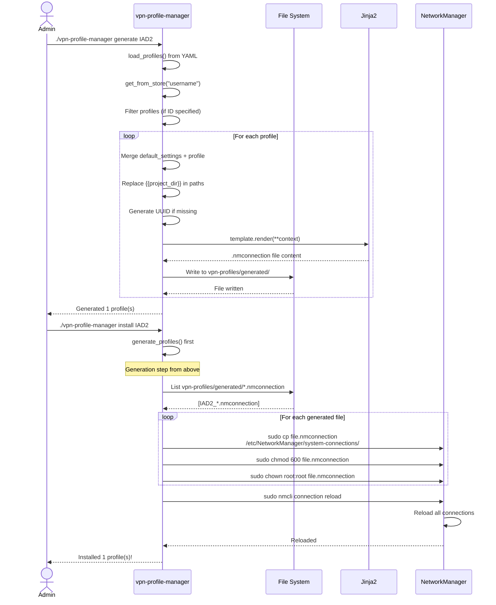

# VPN Connection Workflows

## Overview

This document details all VPN connection workflows in the RH-OTP system.

---

## 1. Standard VPN Connection (via vpn-connect script)

---

## 2. VPN Connection with Specific Profile (via API)

---

## 3. VPN Connection via GNOME Extension

---

## 4. VPN Disconnection

---

## 5. VPN Status Check

---

## 6. VPN Profile Listing

---

## 7. Default VPN Management

---

## 8. Shuttle VPN Connection (Alternative Method)

**Note**: This is a personal workflow using custom infrastructure (hardcoded SSH keys, VPS, etc.)

---

## 9. VPN Profile Installation (Setup)

---

## Key Workflow Characteristics

### Performance

| Workflow | Typical Duration | Blocking Operations |
|----------|------------------|---------------------|
| Standard VPN connect | 3-5 seconds | nmcli negotiation |
| API profile list | 50ms | YAML cache (mtime check) |
| Status check | 100ms | nmcli show --active |
| Disconnect | 1-2 seconds | nmcli down |
| Shuttle connect | 10-15 seconds | SSH + OpenVPN restart |

### Security

| Workflow | Security Measures |
|----------|------------------|
| All API calls | Bearer token authentication |
| Password temp files | chmod 600, immediate deletion |
| Password store | GPG encryption |
| HOTP tokens | Auto-increment counter, single-use |
| Sudo operations | Explicit user action required |

### Reliability

| Workflow | Failure Handling |
|----------|------------------|
| Service wait | Retries every 2s (vpn-connect) |
| Profile caching | File mtime-based invalidation |
| nmcli failures | Captured stderr, logged |
| Missing profiles | HTTPException with clear messages |

---

## Related Documentation

- **[Architecture Overview](../ARCHITECTURE.md)** - System architecture
- **[API Reference](../API.md)** - Endpoint documentation
- **[Authentication Flows](AUTH_FLOWS.md)** - Authentication diagrams
- **[User Guide](../USER_GUIDE.md)** - End-user instructions
